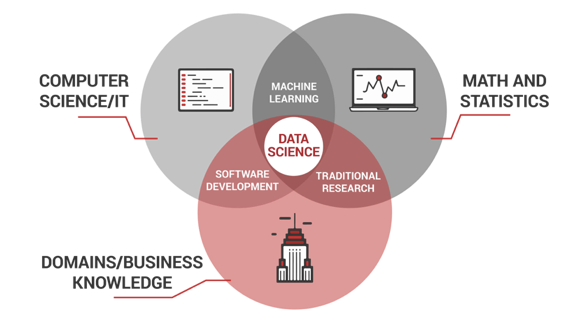
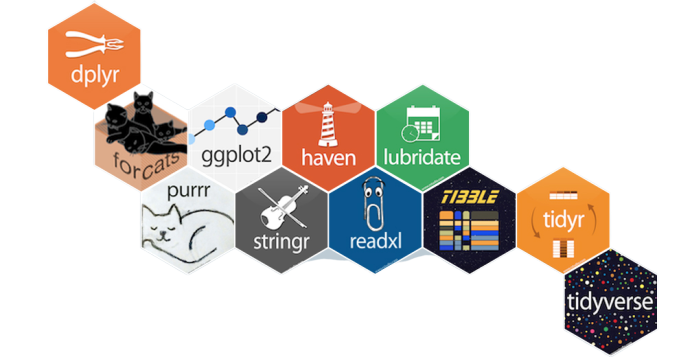
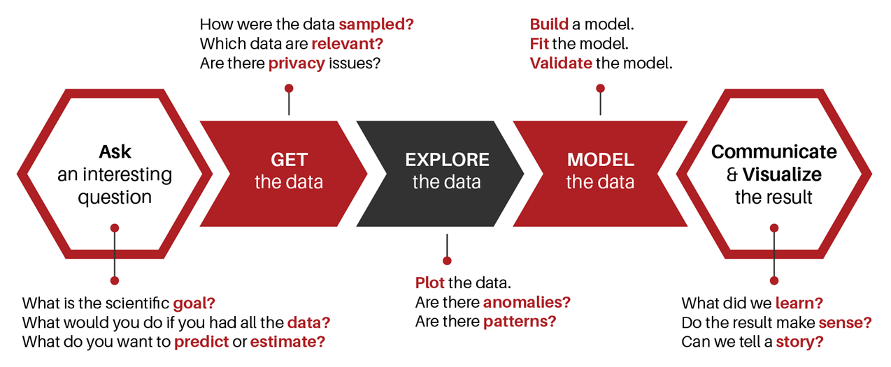

```{r, include=FALSE}
knitr::opts_chunk$set(
  message = FALSE,
  warning = FALSE,
  fig.asp = 0.75,
  fig.align = "center",
  out.width = "100%",
  collapse = TRUE,
  comment = "#>"
)

library(ggplot2)
library(tidyverse)
library(plotly)
library(emo)
```

# Learn Data Science by Building

## **What is Data Science?**

## **Multi-disciplinary Field**

```{r echo=FALSE}

```


## An act of getting **powerful insights** from data

## **Data Science for Data-driven Industry**

<style>
.reveal section img { background:none; border:none; box-shadow:none; }
</style>

```{r echo=FALSE, fig.cap="Source: Sharma, 2019"}
knitr::include_graphics("image/ds-usecase.png")
```

## **The Toolset**

```{r echo=FALSE}

```


## Why learn R and Python?

```{r echo=FALSE, fig.cap="Packages"}

```


* **Open Source**
* R & Python widely used in data science 
* Newbie Friendly
* Ready for Big Data

##

```{r echo=FALSE}
knitr::include_graphics("image/compR.png")
```


* Used by Major Companies
* Has a Large and Welcoming Community

## 

```{r echo=FALSE}

```


# Happy Learning and Coding! :)
